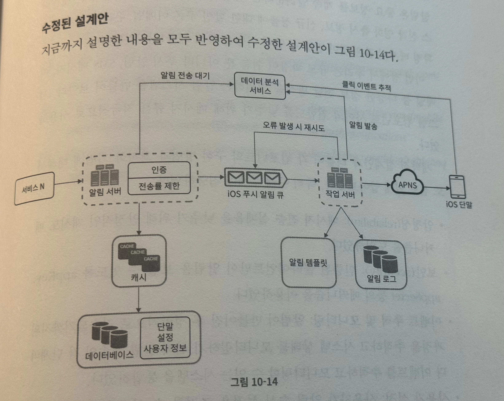

# 10장. 알림 시스템 설계

알림 시스템은 단순히 모바일 푸시 알림에 한정되지 않고 SMS 메시지, 이메일을 포함한다.

## 1단계. 문제 이해 및 설계 범위 확장

- 푸시 알림, SMS 메시지, 이메일 알림을 지원해야 함
- soft-realtime 시스템이어야 함. 즉 알림은 가능한 한 빨리 전달되어야 하지만 높은 부하가 걸렸을 때에는 약간의 지연은 무방함
- IOS, 안드로이드, 랩톱, 데스크톱을 지원해야 함
- 알림은 클라이언트가 만들던 서버가 스케쥴링하던 상관 없음
- 사용자가 알림을 받지 않도록 설정할 수 있어야 함
- 하루 천만 건의 모바일 푸시 알람, 백만 건의 SMS 메시지, 5백만 건의 이메일을 보낼 수 있어야 함

## 2단계. 개략적 설계안 제시 및 동의 구하기

### 알림 유형별 지원 방안

각각 단말은 각기 다른 제3자 전송 서비스를 갖는다.

그림을 첨부하려고 하였으나 어설프게 첨부할 바에는 그냥 책을 보는게 더 나은 것 같습니다. 크게 중요한 부분은 아닌 거 같아가
- IOS
- 안드로이드
- SMS 메시지
- 이메일
- 결론
  - 결국 전송의 주체만 다르지 다 같은 플로우를 가지고 있다는 것을 알 수 있다. => 묶기 쉽다.

### 연락처 정보 수집 절차

사용자 단말에서 앱 설치 혹은 계정 등록 시 API 서버는 다음의 정보들을 데이터베이스에 저장할 수 있다.
- 모바일 단말 토큰
- 전화번호
- 이메일

위 데이터들을 저장하는 테이블 구조도 생각해 봐야 한다. 책의 예제에서는 한 사용자가 여러 단말을 가질 수 있고, 푸시 알림은 해당 사용자의 모든 단말에 보내야 하기에 그에 맞는 테이블 구조를 보여준다.

### 알림 전송 및 수신 절차

**개략적 설계안 (초안)**
- **알림 시스템**에 알림 발행을 요청하는 주체는 다양할 수 있다.
  - 마이크로 서비스
  - 크론잡
  - 분산 시스템 컴포넌트
    - 과금 서비스
    - 배송 알림을 보내려는 쇼핑몰 웹사이트
- **알림 시스템**이 결국 해내야 하는 역할은 크게 다음 두 가지다.
  - 위 알림 발행 요청 주체들에게 알림 전송을 위한 API를 제공해야 한다.
  - 제3자 서비스에 전달한 알림 페이로드를 만들어 낼 수 있어야 한다.
- **알림 시스템**과 제3자 전송 서비스와의 통합 시 **확장성**을 유의해야 한다.
  - 어떤 제3자 전송 서비스는 특정 국가에서 사용 불가하기에 다른 전송 서비스를 추가해야한다던가 하는 일이 비일비재하다.
- 단말들은 알림을 수신한다.

위 초안에는 **알림 시스템**을 단일 서버 시스템으로 두는데 이럴 경우 당연하게도 아래와 같은 문제가 발생할 수 있다.
- SPOF
- DB나 캐시 등의 규모 확장성 (얘네도 단일 서버 안에 있으므로)
- 성능 병목

**개략적 설계안 (개선된 버전)**
- 데이터베이스, 캐시 분리
- 서버 증설 및 수평적 규모 확장이 가능하도록 분산시스템 구성
- 메시지 큐를 이용해 컴포넌트 사이 강결합 해제
  - 여기서 말한 컴포넌트란 다음 애들을 말하는 것으로 보임
    - **알림 서버**: 알림 발행 요청을 받아 그에 알맞는 페이로드를 구성하는 컴포넌트 (DB IO 발생, 혹은 외부 API 네트워크 IO 발생)
    - **작업 서버**: 만들어진 컴포넌트를 제3자 전송 서비스에 요청하는 컴포넌트 (외부 네트워크 IO 발생)
  - 두 컴포넌트 사이에 메시지 큐를 두어 IO가 발생하는 작업 간의 결합을 약화시킴
    - 병목 상황에 따라 개별적인 수평 확장 가능해 짐
- 본 설계안에서는 제3자 전송 서비스 별로 mq 및 작업 서버를 따로 둠
  - 이로 인해 한 서비스에서 장애가 발생해도 나머지는 영향을 받지 않음
  - 각 서비스 별 트래픽에 따라 특정 큐와 작업 서비스를 조절하는 방식으로 유연하게 대처 가능

## 3단계. 상세 설계

개략적 설계가 끝났으니 디테일한 부분들을 좀 더 자세히 알아 보자.

### 안정성

**데이터 손실 방지**

알림이 지연되거나 순서가 틀려도 괜찮지만 **알림이 소실되면 절대로 안된다.** 이는 알림 전송 시스템의 가장 중요한 요구사항 중 하나다.
알림 로그를 데이터베이스에 보관하고 재시도 메커니즘을 구현함으로써 대응할 수 있다.

제가 운영하는 카리브에서도 심사 요청이 소실되지 않도록 mq를 이용할 때 재시도 전략이 수립되어 있습니다.

**알림 중복 전송 방지**

분산 시스템 특성 상 일관성 이슈로 가끔은 같은 알림이 중복되어 전송되기도 한다.
이 빈도를 줄이려면 중복 탐지 메커니즘을 도입하고 오류 처리를 신중히 해야한다.
간단한 중복 방지 로직으로 이벤트 ID를 검사하여 중복된 이벤트인지 확인하는 방법이 있다.
그러나 중복 전송을 100% 방지하는 것은 불가능한데 이는 아래 링크를 참고하자.

[You Cannot Have Exactly-Once-Delivery](https://bravenewgeek.com/you-cannot-have-exactly-once-delivery/)

으악

- 개요
  - delivery 의미론에 대한 3가지 타입
    - at most once
    - at least once
    - exactly once
  - exactly once는 사실상 불가능
  - at least once도 엄격하게는 사실상 불가능 (ISP 에서의 에러 발생) 그러나 그냥 가능하다고 본다.

- exactly once는 왜 불가능한가?
  - 이미 잘 알려진 분산 컴퓨팅의 증명된 이론들
    - Two Generals' Problem
    - Byzantine Generals Problem
    - Fischer-Lynch-Paterson (FLP) Impossibility Theorem
  - 네트워크 장애나 프로세스 충돌 가능성이 있는 시스템에서는 모든 프로세스가 특정 사실에 대해 100% 합의하는 것이 불가능함
  - 메시지를 보냈을 때, 메시지 자체가 유실되었는지, 아니면 메시지는 잘 도착했지만 수신 확인(acknowledgment) 응답이 유실되었는지 송신자 입장에서 완벽하게 구분할 방법이 없다.
  - 어쨌든 결국 네트워크 상에서 각 컴포넌트 사이에 **완벽히 보장되는** 전달은 없다는 것을 뜻하는 듯.
    - 분산 시스템에는 많은 컴포넌트가 있고 그 사이 많은 관계가 있다.
    - 어떠한 관계에 대해서도 상호간에 100% 라는건 보장할 수 없다.
    - 따라서 전체 분산 컴퓨팅 시스템에서 100%라는건 존재할 수 없다.
  - CP 시스템 또한 중복 전달을 제거할 수 있지만 100%의 전달을 보장하지는 못한다.
    - 강력한 일관성 보장으로 같은 데이터가 한번만 가게는 할 수 있다.
    - 그러나 소비자가 메시지를 처리하다가 수신 확인을 보내기 전에 죽으면 메시지는 영원히 유실될 수 있다.
    - 즉 CP도 at most once 를 제공할 수는 있지만 exactly once는 불가능 하다는 것
  - exactly once를 주장하는 놈들은 다 거짓말쟁이

- 그래서 결국?
  - 멱등성
    - 분산 시스템 상에 여러 컴포넌트 혹은 네트워크 이슈로 하나 이상의 메시지가 중복 전달될 가능성을 염두에 두고 컴포넌트들 사이의 각 동작이 멱등성을 유지할 수 있도록 설게해야 함.
    - 요걸 상태 머신을 이용해 설명한다.
      - 상태를 변경하는 작업을 분산하기 보다는 변경된 상태를 분산하라
      - 즉, 각 노드는 상태를 변경하기 보다는 다양한 시점의 사실만 보고하라
      - 친구가 나를 픽업하러 올 때 오는 길을 설명하지 말고 나의 위치를 말해줘라
  - 중복 제거
    - 언제든 중복된 메시지가 전달될 수 있기에 클라이언트단에서 중복을 검사해 제거하는 부분이 필요하다.

### 추가로 필요한 컴포넌트 및 고려사항

**알림 템플릿**

알림은 보통 중복되는 양식을 사용하기에 템플릿을 저장해두고 인자만 삽입하는 방식으로 운영하면 다음과 같은 장점을 얻을 수 있다.
- 전송될 알림들의 형식을 일관성 있게 유지 가능
- 오류 가능성 감소
- 알림 작성 시간 감소

**알림 설정**

맨 앞에서 요구사항에 '사용자가 알림을 받지 않도록 설정할 수 있도록 함' 이라는 요구사항을 만족시킬 수 있게 설정 테이블을 별도로 운영할 수 있다.

**전송률 제한**

알림을 많이 보낼수록 사용자가 알림 기능 자체를 꺼 버릴 가능성이 올라간다.
한 사용자가 받을 수 있는 알림의 빈도를 제한하면 이러한 사이드 이펙트를 방지할 수 있다.

**재시도 방법**

제3자 서비스가 알림 전송에 실패하면 해당 알림을 재시도 전용 큐에 넣는다.
재시도 후에도 같은 문제가 계속 발생하면 개발자에게 에러 알림을 전송한다.

앞장에서 나온 데이터 손실 방지와도 연관이 있는 항목으로 재시도 전략을 잘못 수립하여 실패한 요청이 소실되지 않도록 각별한 주의가 필요할 것이다.

**푸시 알림과 보안**

당연히 인증된 클라이언트만 알림 전송 API를 사용할 수 있어야 한다.
보통 보증된 appKey와 appSecret을 이용하여 보안을 유지한다.

**큐 모니터링**

큐에 쌓인 알림의 개수를 실시간으로 모니터링 할 수 있어야 한다.
그 수가 너무 크다면 작업 서버들이 이벤트를 빠르게 처리하고 있지 못하다는 뜻이다
이 메트릭을 이용해 어떤 서버를 증설하고 감축할 지를 정할 수 있을 것이다.

**이벤트 추적**

알람 확인율, 클릭율, 실제 앱 사용으로 이어지는 비율 같은 메트릭은 사용자를 이해하는데 중요하다.
데이터 분석 서비스는 보통 이벤트 추적 기능도 제공하기에 보통 알림 시스템을 만들면 이러한 데이터 분석 서비스와도 통합한다.

## 4단계. 마무리

### 수정된 설계안

