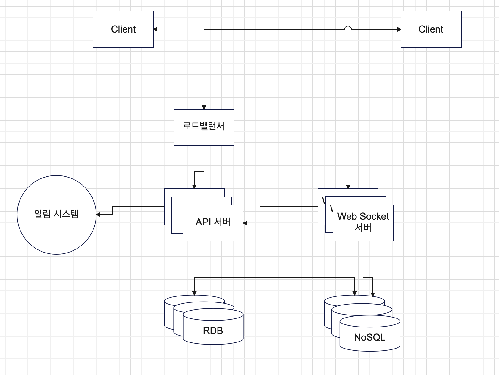

# Jaws 12장 질문
## 설?계

- 채팅서버끼리 메시지를 주고 받는 부분을 생각하지 몬함
## 데이터 모델
### 그룹 채팅을 위한 메시지 테이블
- 테이블에 message_to가 아니라 message_from이 있어야 하는거 아닌가?
- 애초에 1:1과 그룹을 데이터 상에서 나눌 필요가 있나?
  - 1:1은 2명만 속한 그룹과 같지 않은가?
## 메시지 동기화 및 접속 상태
- mq의 topic 개념을 이용하면 n명이 속한 그룹이라도 n개의 메시지를 복사해서 보낼 필요는 없지 않나?
  - topic에서 순서 보장이 안되는 단점은 클라이언트단에서 조정하는 식으로 대응 가능하지 않나?
  - 책에서 말한 비용이 애초에 인프라 비용 (발행은 하나만 하면 되지만 mq 내부적으로는 N개의 구독자한테 나눠 전송하는 데 드는 비용?) 을 산정하고 말한 것인가?