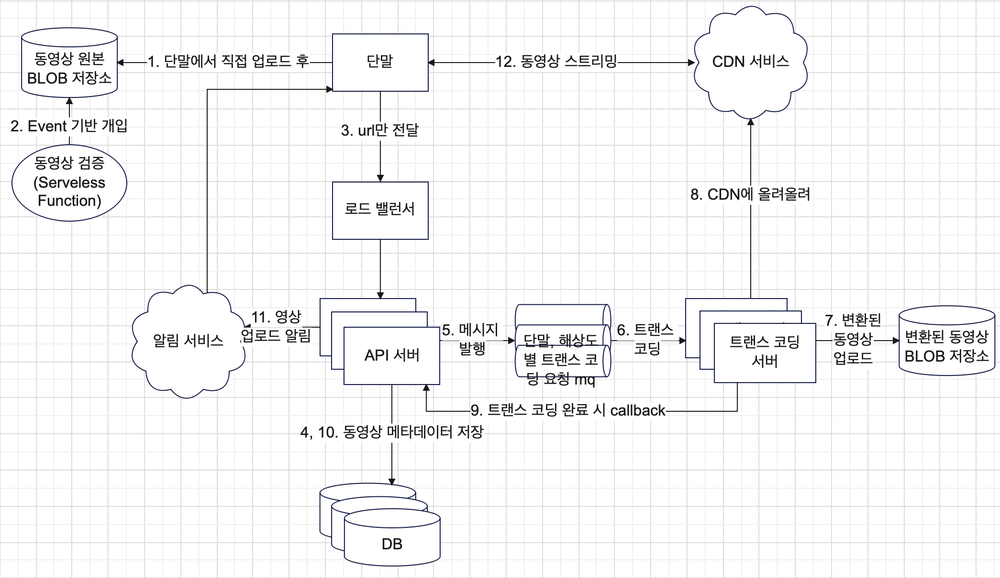

# Jaws 14장 질문
## 설?계

## 비디오 트랜스코딩 아키텍처
### 자원 관리자
- 작업 서버 큐에는 어떤 가용 상태 정보가 있을까요?
  - 가용 가능 상태가 되면 큐로 메시지를 발행하는 방식인가? 나 논다~~ 이렇게?
  - 이걸 굳이 큐로 관리하는 이유가 있을까요?
- 실행 큐도 위와 마찬가지로 어떤 정보가 있고 굳이 큐로 관리하는 이유는 무엇일까요?
  - 작업이 완료되면 실행 큐에서 해당 작업을 제거한다고 했는데 어떻게?
  - 이럴거면 큐를 왜 씀?
## 시스템 최적화
### 속도 최적화
- 트랜스 코딩 뿐만 아니라 업로드 할 때도 GOP로 쪼개서 하므로써 이득을 볼 수 있구나
- 미디어(특히 동영상)은 용량이 크므로 처리가 오래 걸린다. 그러므로 병렬화 할 수 있는 부분에 최대한 병렬화를 적용해 속도 최적화를 꾀할 수 있을 것이다.
  - 트랜스 코딩 서버에서 원본을 다운로드 받는 것, 인코딩을 하는 것, 인코딩 된 영상을 업로드 하는 것 모두 병렬로 가능하다!

