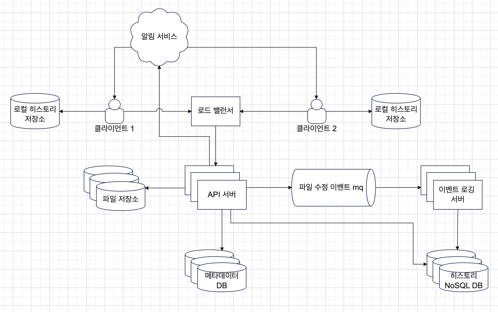

# Jaws 15장 질문
## 설?계

- 파일의 동기화 관리라는 추가 로직이 있기에 동영상과 달리 클라이언트에서 직접 업로드 보다는 서버를 경유하는 식으로 설계함.
- 파일 저장용 블록 저장소 서버를 따로 둘 생각을 못했다.
  - 애초에 블록 저장 같은 상세 설계를 미리 생각하지 않았다.
- 클라우드 스토리지는 api 서버로 callback 설정을 지원한다.
- 강력한 일관성 보장을 위해 이벤트(히스토리) 로깅용 서버를 합칠 필요가 있어 보인다.
## 질문
### 오프라인 사용자 백업 큐
- 꼭 필요한가?
- 접속 시 메타데이터들만 불러오면 되지 않나?
  - 이 오버헤드를 줄이기 위해 해당 아키텍처의 복잡도를 감수할 필요가 있는가?
### 높은 일관성 요구사항
- 본인이 운영하는 서버는 RDB와 MongoDB를 모두 이용한다. 당연히 둘 모두에 대해 수정이 발생했을 때 트랜잭션 보장이 안된다. 이를 위해 몽고 수정사항 관련한 데이터를 Outbox(RDB)로 저장하고 이후 배치 작업을 통해 검토 작업을 가진다. 그런데 이는 강력한 일관성은 보장하지 못한다. 강력한 일관성 보장을 위해선 어떻게 해야할까? 또, 여러분들은 어떻게 하고 계신가?
### 다운로드 절차
- 변경 알림이 발생했다고 무조건 자동으로 다운로드가 되어야 하는가?
  - 메타 데이터만 자동으로 받아가면 되지 않나?
  - 구글 드라이브도 다운로드를 미리 해놓지는 않잖아
  - 파일이 켜져 있을 때를 얘기하는 건가? 그렇다면 맞죠
    - 실시간 편집 신경쓰지 말라매
  - 알림 수신에 롱 폴링을 사용하는 부분이 인상깊네요.
### 저장소 공간 절약
- 저장소 공간 절약에 있어 여러 방법을 설명하는데, 모든 방법이 특정 버전을 직접 저장하는 방식을 사용한다.
  - 이벤트 로그만 관리한다면 특정 버전으로 얼마든지 돌아갈 수 있지 않은가?
### 장애 처리
- 로드 밸런서 장애가 나왔네요. 이 책에서 처음 나온거 아닌가요?

